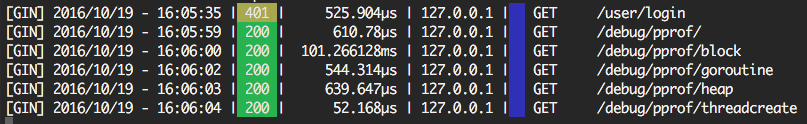
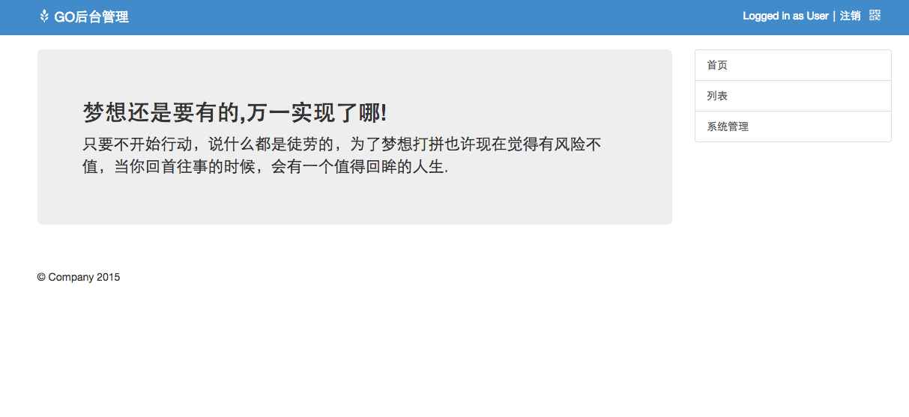

# 欢迎使用GO Gin API Framework

@(示例笔记本)[马克飞象|帮助|Markdown]

**GIN API Framework**是一款专为Go Gin 框架打造的API Framework，通过精心的设计与技术实现，集成了大部分稳定开发组件，memcache consistance Hash，redis，nsq，api doc ，mysql 等。特点概述：


如果您考虑采用**微服务框架** 请参见 [Micro_API_Framework](https://github.com/edisonlz/Micro_API_Framework)


 
- **功能丰富** ：支持大部分服务器组件，支持API Doc；
- **得心应手** ：简单的实例，非常容易上手；
- **深度整合** ：深度整合memcache，redis，mysql，beego ，gin 框架。
- **API安全** : 在nginx层使用lua插件，对api签名并校验。
- **性能优先** ：为啥不直接使用beego那，因为gin是目前httprouter性能最高，占用资源最少的框架，而beego orm是目前最接近django的框架，so...。


-------------------

[TOC]


## 环境配置
##### 部署服务
- go version go1.13.6 ([golang.org](https://golang.google.cn/dl/)) 下载当前版本或最新版本
- godep ( https://github.com/tools/godep)
- $GOPATH 设置 
```go
示例
export GOPATH="/Users/ed/gocode"
export PATH=$PATH:$GOROOT/bin:$GOPATH/bin
```

- git clone https://github.com/edisonlz/Gin_API_Framework.git
```
代码需要clone到 $GOPATH/src 下
```
- cd Gin_API_Framework/ && godep restore

```bash
godep restore 可能会失败
可以将vendor下代码复制到 $GOPATH/src 下
ed@localhost src$ ls
Gin_API_Framework back              github.com        golang.org        gopkg.in
```


## 开始使用

##### 生成API文档
    $ cd api
    $ go run gen_doc.go 

##### 执行服务
    $ cd api
    $ go run main.go

##### 同步数据库模型
    $ go run orm_sync.go orm syncdb

##### 执行服务
    $ go run main.go
    $ open http://127.0.0.1:8080/doc


### 框架结构
### API 目录结构
- controllers ： API  接口代码
- routers：API路由配置代码
- middleware：中间件代码
- docs: 生成api文档代码

### 公共目录
- utils：常用方法代码
- vendor：godep save 生成依赖代码
- background：后端定时/异步服务代码
- models：ORM数据模型代码
- static：静态文件代码

### Web 目录结构
- web-controllers [controller代码]
- web-routers [http 路由配置]
- conf [beego config file]


### 代码块
``` go
// @Title User Query By ID
// @API_GROUP User
// @Description 查询用户接口通过用户ID
// @Success 200 {object} 
// @Param   uid     query   string false       "user id"
// @Failure 400 no enough input
// @Failure 500 get  common error
// @router /user/query [get]
func UserQueryByIdHandler(c *gin.Context) {

    suid := c.Query("uid")
    uid , error := strconv.Atoi(suid)
    if error != nil {
        c.JSON(400, gin.H{
            "status":  "fail",
            "msg": "字符串转换成整数失败",
        })
        return
    }

    u := user.UserQueryById(uid)

    c.JSON(http.StatusOK, gin.H {
        "status":  "success",
        "user": u,
    })

}

```

### API文档生成规则
```go
// @Title User Query By ID
// @API_GROUP User
// @Description 查询用户接口通过用户ID
// @Success 200 {object} 
// @Param   uid     query   string false       "user id"
// @Failure 400 no enough input
// @Failure 500 get  common error
// @router /user/query [get]
```


### ORM层
``` go

func UserList() (users []User) {

    o := orm.NewOrm()
    qs := o.QueryTable("user")

    var us []User
    cnt, err :=  qs.Filter("id__gt", 0).OrderBy("-id").Limit(10, 0).All(&us)
    if err == nil {
        fmt.Printf("count", cnt)
        for _, u := range us {
            fmt.Println(u)
        }
    }
    return us
}


```


### 缓存配置
``` go

inmem_store := cache.NewInMemoryStore(time.Second)
memcached_store := cache.NewMemcachedStore([]string{"localhost:11211"},time.Minute * 5)
    
v1.GET("/list",  cache.CachePage(inmem_store, time.Minute * 5 ,controllers.UserListHandler))

```


### 中间件配置
``` go

router.Use(nice.Recovery(recoveryHandler))

func recoveryHandler(c *gin.Context, err interface{}) {
    c.JSON(400,  gin.H{
        "status": "fail",
        "err":   err,
    })
}

```

### go pprof debug
``` go

ginpprof.Wrapper(router)}

go http://127.0.0.1:8080/debug/pprof/

```


### go Async Queue Message by Redis
目录: Gin_API_Framework/background
``` go
package main

import ( 
        "Gin_API_Framework/utils/redis_model"
        _"encoding/json"
        "log"
)


func sync_hello(dic map[string]interface{}) {

    log.Println("[sync_hello]...")
    log.Println("[recive dict]",dic)

    for key,value:=range dic {
        log.Println(key,value)
    }

}

func aysnc_do(queue *redis_model.RedisQueue) {
    value := map[string]interface{}{}
    value["hello"] = 1
    value["world"] = 2

    queue.ASync(value)
}


func main(){

    queue := redis_model.NewRedisQueue("channel.test")
    aysnc_do(queue)

    //queue do work
    queue.Do(sync_hello)

}

```

###Profile
```
API goroutine monitor profile
https://github.com/DeanThompson/ginpprof
```

### API 响应时间
##### 默认情况都是微秒


run_api
#### 各个框架性能对比
https://gin-gonic.com/docs/benchmarks/

## Web 后台使用beego框架构建
##### 服务展示


##### 启动服务
$ go run web_main.go

##### 目录框架结构
- web-controllers [controller代码]
- web-routers [http 路由配置]
- conf [beego config file]
- 其他目录例如models 为公用

##### View Controller 构建
``` go

type MainController struct {
    beego.Controller
}

func (this *MainController) Get() {
    this.TplName = "index.html"
    this.Layout = "layout/layout.html"
    this.Render()
}

```


##### API安全数字签名，此功能适合高手

``` go

1）API接口安全规则
Method ： GET | POST
增加参数:
_s_: signature 签名
_t_: 当前时间戳，校队系统时间在初始化接口返回,接口参数有效期30分钟
_t_ = timestamp = timestamp + (客户端当前时间 - 客户端从初始化获得timestamp的时间)
这样做到原因是需要客户端校对服务器时间，因为客户端时间有可能不准确。

签名方式:
token_string = req_method + ":" + path + ":" + sorted(query) + ":" + timestamp + ":" + secret
其中：sorted(query) 是按照key的自然顺序排列,然后以key=value的形式累加
例如: GET /test?b=2&a=1
token_string = GET + ":" + /test + ":" + a=1b=2 + ":" + 1457665234 + ":" + secret_xxxxxx
signature = ngx.md5(token_string)

*method为post的情况下，需要将请求发到body中，不支持url参数post*

接口返回状态码为 410 请重新更新服务器时间。
接口返回 403 为签名错误，访问被禁止。

``` 

``` go

2）Nginx 部署，详见 deploy.secure.api.sh
- 这里建议使用 nginx-1.0.4 版本，稳定/性能高。
- deploy.secure.api.sh部署起来过于繁琐，需要花费一定的时间和经历。
``` 


``` go
3）nginx配置示例
  #lua配置地址：api/conf/nginx/lua
  #签名密钥配置：api/conf/nginx/lua/check_pid_signature.lua
              local secret = "62406d2ff6c40894a26a3ad34eafff2f" #32位字符串


    location / {

        add_header Access-Control-Allow-Origin *;
        add_header Access-Control-Allow-Headers X-Requested-With;
        add_header Access-Control-Allow-Methsods GET,POST,OPTIONS;

        #引入效验文件，如上传图片，初始化接口可不加载该配置
        access_by_lua_file conf/lua/check_pid_signature.lua;

        proxy_pass          http://make_app_api;
        proxy_connect_timeout 3;
        proxy_send_timeout 3;
        proxy_read_timeout 3;
        proxy_redirect      default;
        proxy_set_header    X-Forwarded-For $proxy_add_x_forwarded_for;
        proxy_set_header    X-Real-IP $remote_addr;
        proxy_set_header    Host $http_host;
        proxy_set_header    Range $http_range;
    }

``` 
##### 作者：（优酷）hep