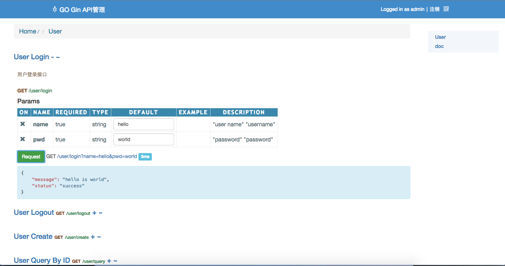

# 欢迎使用GO Gin API Framework

@(示例笔记本)[马克飞象|帮助|Markdown]

**GIN API Framework**是一款专为Go Gin 框架打造的API Framework，通过精心的设计与技术实现，集成了大部分稳定开发组件，memcache consistance Hash，redis，nsq，api doc ，mysql 等。特点概述：
 
- **功能丰富** ：支持大部分服务器组件，支持API Doc；
- **得心应手** ：简单的实例，非常容易上手；
- **深度整合** ：深度整合memcache，redis，mysql，beego ，gin 框架。


-------------------

[TOC]

## 开始使用

#####执行服务
    $ go run main.go
#####生成文档
    $ go run gen_doc.go
#####同步数据库模型
    $ go run orm_sync.go

## 环境配置
#####部署服务
- go version go1.6.3 (golang.org) 翻墙
- godep ( https://github.com/tools/godep)
- cd Gin_API_Framework/    && godep restore

#####执行服务
    $ go run main.go


###框架结构
- controllers ： API  接口代码
- models：ORM数据模型代码
- routers：API路由配置代码
- middleware：中间件代码
- static：静态文件代码
- utils：常用方法代码
- vendor：godep save 生成依赖代码
- background：后端定时/异步服务代码


### 代码块
``` go
// @Title User Query By ID
// @API_GROUP User
// @Description 查询用户接口通过用户ID
// @Success 200 {object} 
// @Param   uid     query   string false       "user id"
// @Failure 400 no enough input
// @Failure 500 get  common error
// @router /user/query [get]
func UserQueryByIdHandler(c *gin.Context) {

    suid := c.Query("uid")
    uid , error := strconv.Atoi(suid)
    if error != nil {
        c.JSON(400, gin.H{
            "status":  "fail",
            "msg": "字符串转换成整数失败",
        })
        return
    }

    u := user.UserQueryById(uid)

    c.JSON(http.StatusOK, gin.H {
        "status":  "success",
        "user": u,
    })

}

```


### ORM层
``` go

func UserList() (users []User) {

    o := orm.NewOrm()
    qs := o.QueryTable("user")

    var us []User
    cnt, err :=  qs.Filter("id__gt", 0).OrderBy("-id").Limit(10, 0).All(&us)
    if err == nil {
        fmt.Printf("count", cnt)
        for _, u := range us {
            fmt.Println(u)
        }
    }
    return us
}


```


### 缓存配置
``` go

inmem_store := cache.NewInMemoryStore(time.Second)
memcached_store := cache.NewMemcachedStore([]string{"localhost:11211"},time.Minute * 5)
    
v1.GET("/list",  cache.CachePage(inmem_store, time.Minute * 5 ,controllers.UserListHandler))

```


### 中间件配置
``` go

router.Use(nice.Recovery(recoveryHandler))

func recoveryHandler(c *gin.Context, err interface{}) {
    c.JSON(400,  gin.H{
        "status": "fail",
        "err":   err,
    })
}

```
